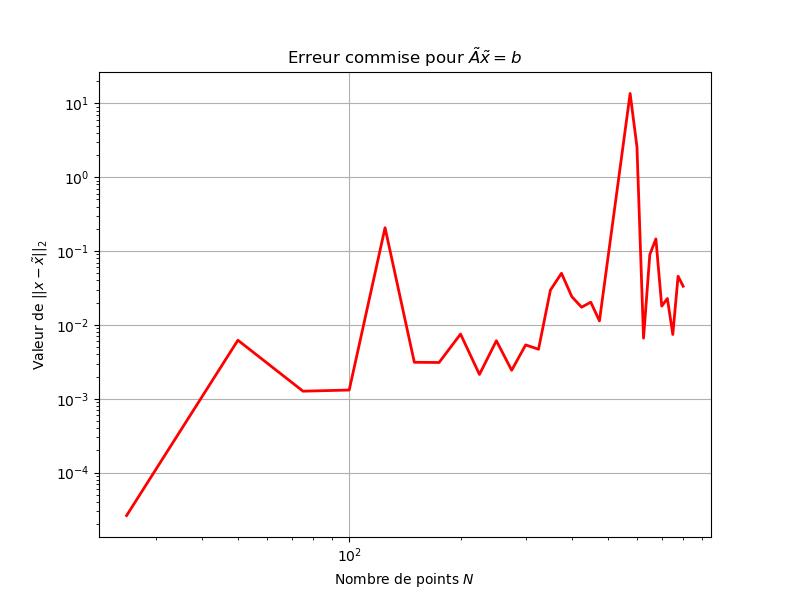

# Mise en place d'un solveur pour matrice $\mathcal{H} ^ 2$

Codes Python réalisés lors de mon stage de master sur la mise enplace d'un solveur pour matrice $\mathcal{H}^2$.

## Installation de $h2tools$

Pour ces codes, il est nécessaire d'installer différents packages Python :

* pip 
* numpy
* numba
* scipy
* cython
* maxvolpy
* pypropack
* h2tools

Un tutoriel est (en cours) disponible dans le rapport de ce stage.


## Analyse de l'approximation numérique par matrice $\mathcal{H} ^ 2$

[A FAIRE]


## Analyse du produit matrice-vecteur pour une matrice $\mathcal{H} ^ 2$

La classe 'H2Matrix' contient déjà un produit scalaire matrice-vecteur nommé $.dot()$. Il est alors intéressant d'étudier l'erreur commise par cette opération pour une matrice aléatoire de taille $N \times N$, et en fonction de $\tau > 0$


On voit alors que l'ordre de l'erreur suit *linéairement* la précision $\tau$. 

## Solveur itératif de Krylov

La classe 'H2Matrix' étant un format data-sparse, elle ne donne accès qu'à très peu d'information quant à la matrice. Comme on l'a vu plus haut, cette classe embarque un produit matrice-vecteur, néanmoins aucune autre opération n'est disponible. Il est donc sensé d'utiliser des algorithmes itératifs dans l'objectif de résoudre :

$$ \hat{A}\tilde{x} = b $$

Avec :
* $\hat{A}$ matrice $\mathcal{H} ^ 2 (\mathbb{R} ^ {N \times N})$
* $b\in\mathbb{R} ^ {N }$ vecteur source 
* $\tilde{x}\in\mathbb{R} ^ {N }$ vecteur solution

Nous allons nous intéresser aux solveurs itératifs de Krylov, en particulier les algorithmes GMRES car ils ne nécessitent qu'un produit matrice-vecteur pour fonctionner.

Dans un premier temps, utilisons la fonction *scipy.sparse.linalg.gmres* ( ou une de ses variantes *scipy.sparse.linalg.lgmres*) afin de réaliser un tel algorithme.

Il est à noter que pour utiliser ces fonctions il faut rajouter un un attribut dans le fichier $h2matrix.py$. Il faudra ajouter :

```
def mat_vec(self,x):
	return self.dot(x)
```

Afin que *scipy* puisse utiliser un produit matrice-vecteur.

En faisant varier le nombre de points $N$, on peut alors obtenir l'erreur suivante :

$$\| x - \tilde{x} \|_2,~\mathrm{avec}~x\in\mathbf{R} ^ N~ : Ax=b$$




Ce résultat est peu satisfaisant car pour des matrices de petites taille ($600 \times 600$), l'erreur est déjà de l'ordre de $10^{-1}$.

Il est peut-être envisageable de coder un solveur itératif de Krylov nous-mêmes !

[WORK IN PROGRESS]


## Solveur direct

L'article [faire ref] présente un algorithme permettant de résoudre :

$$ \hat{A} x = b $$

Avec :
* $\hat{A}$ matrice $\mathcal{H} ^ 2 (\mathbb{R} ^ {N \times N})$
* $b\in\mathbb{R} ^ {N }$ vecteur source 
* $x\in\mathbb{R} ^ {N }$ vecteur solution

Nous nous proposons alors d'implémenter cette méthode.

### Idée générale

Le but est en réalité de décomposer la matrice dense $A$ :


$$ A \approx U S V ^ T$$

Avec :
* $S$ matrice sparse $\mathbb{R} ^ {N \times N}$
* $U, V\in\mathbb{R} ^ {N \times N}$ matrices orthogonales.

On peut alors résoudre en posant $x=Sy$ :

$$Sy = U ^ T b$$

L'idée est alors d'obtenir $U, S, T$ via un algorithme itératif menant à la compression de $A$ par des matrices sparses.