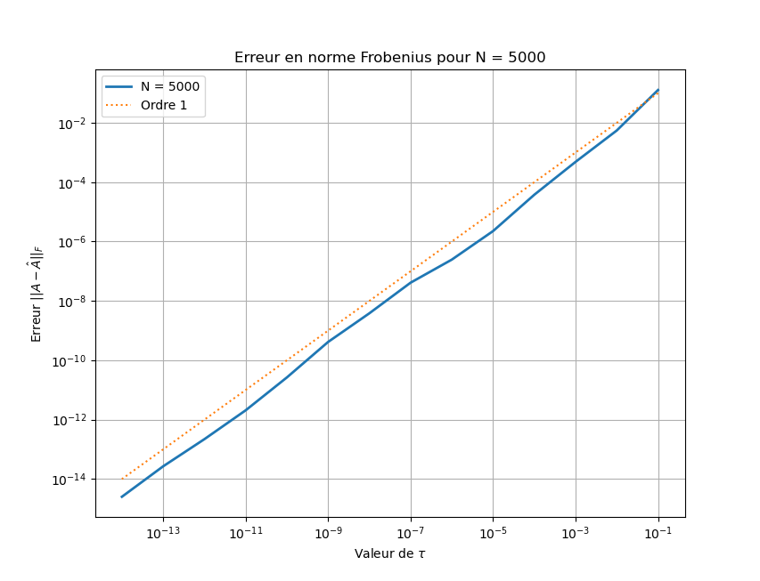
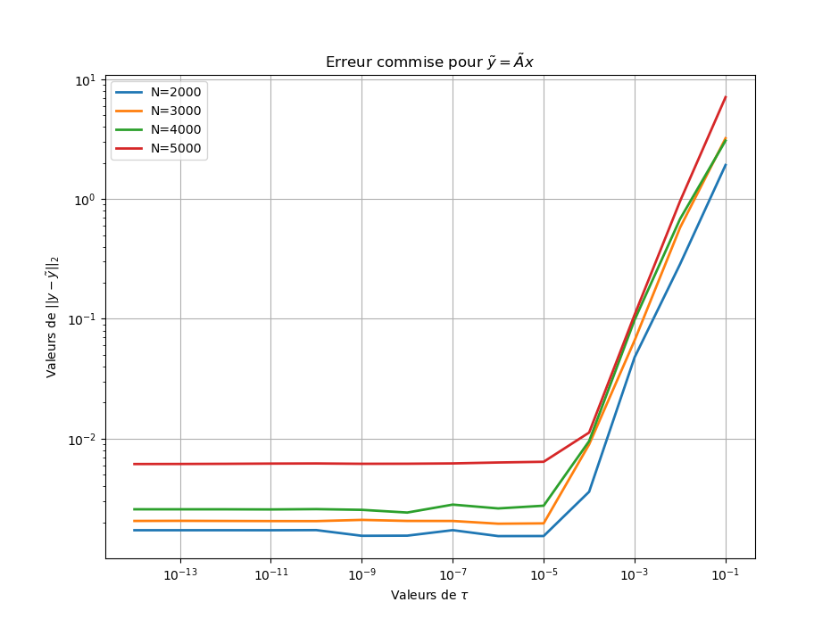
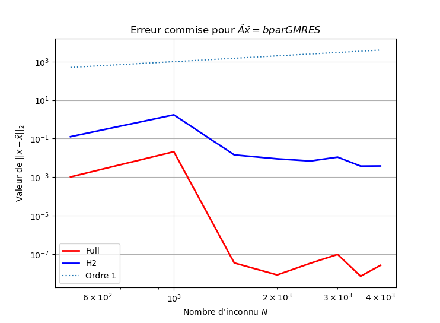
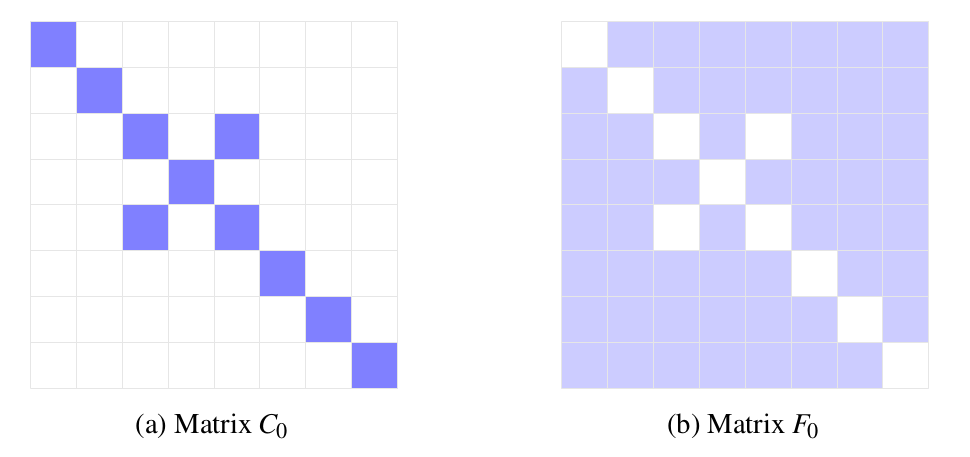
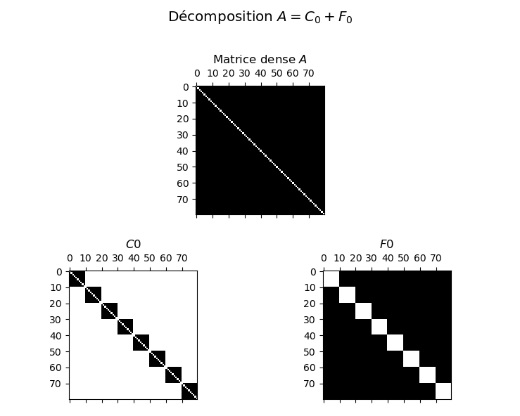

# Mise en place d'un solveur pour matrice $\mathcal{H} ^ 2$

Codes Python réalisés lors de mon stage de master sur la mise enplace d'un solveur pour matrice $\mathcal{H}^2$.

## Installation de $h2tools$

Pour ces codes, il est nécessaire d'installer différents packages Python :

* pip 
* numpy
* numba
* scipy
* cython
* maxvolpy
* pypropack
* h2tools

Un tutoriel est (en cours) disponible dans le rapport de ce stage.


## Analyse de l'approximation numérique par matrice $\mathcal{H} ^ 2$

On peut tout d'abord se demander si la package $h2tools$ approche correctement les matrices denses par des matrices $\mathcal{H} ^ 2$. On rappelle alors la norme d'opérateur pour : 

$$\| A \| = \underset{{x \neq 0}}{\underset{\|x\|_2 \leq 1}{\sup}} \frac{\|Ax\|_2}{\|x\|_2}$$


Pour cela, on peut utiliser l'outil mis en place $.diffnorm()$ qui, à l'aide d'un autre package, calcul l'erreur :

$$ \| A - \hat{A} \|$$

Avec :
* $A\in\mathcal{M}_N(\mathbb{R})$ matrice dense
* $\hat{A}$ matrice $\mathcal{H}^2 $ de $A$
* $N \in \mathbb{N}$ 

On peut alors analyser numériquement cette erreur :



On voit alors que l'erreur en norme Frobenius suit *linéairement* la précision $\tau$.

## Analyse du produit matrice-vecteur pour une matrice $\mathcal{H} ^ 2$

La classe 'H2Matrix' contient déjà un produit scalaire matrice-vecteur nommé $.dot()$. Il est alors intéressant d'étudier l'erreur commise par cette opération pour une matrice aléatoire de taille $N \times N$, et en fonction de $\tau > 0$




On voit alors que l'ordre de l'erreur suit *linéairement* la précision $\tau$. 

## Solveur itératif de Krylov

La classe 'H2Matrix' étant un format data-sparse, elle ne donne accès qu'à très peu d'information quant à la matrice. Comme on l'a vu plus haut, cette classe embarque un produit matrice-vecteur, néanmoins aucune autre opération n'est disponible. Il est donc sensé d'utiliser des algorithmes itératifs dans l'objectif de résoudre :

$$ \hat{A}\tilde{x} = b $$

Avec :
* $\hat{A}$ matrice $\mathcal{H} ^ 2 (\mathbb{R} ^ {N \times N})$
* $b\in\mathbb{R} ^ {N }$ vecteur source 
* $\tilde{x}\in\mathbb{R} ^ {N }$ vecteur solution

Nous allons nous intéresser aux solveurs itératifs de Krylov, en particulier les algorithmes GMRES car ils ne nécessitent qu'un produit matrice-vecteur pour fonctionner.

Dans un premier temps, utilisons la fonction *scipy.sparse.linalg.gmres* ( ou une de ses variantes *scipy.sparse.linalg.lgmres*) afin d'utiliser un tel algorithme.

Il est à noter que pour utiliser ces fonctions il faut transformer la matrice au format $\mathcal{H} ^ 2$ en un opérateur linéaire via :

```
A_h2 = scipy.sparse.linalg.LinearOperator((N, N), matvec=A_h2.dot)
```

Afin que *scipy* puisse l'utiliser pour la fonction $gmres$.

En faisant varier le nombre de points $N$, on peut alors obtenir l'erreur suivante :

$$\| x - \tilde{x} \|_2,~\mathrm{avec}~x\in\mathbb{R} ^ N~ : Ax=b$$




## Solveur direct

L'article [@sushnikova2018simple] [faire ref] présente un algorithme permettant de résoudre :

$$ \hat{A} x = b $$

Avec :
* $\hat{A}$ matrice $\mathcal{H} ^ 2 (\mathbb{R} ^ {N \times N})$
* $b\in\mathbb{R} ^ {N }$ vecteur source 
* $x\in\mathbb{R} ^ {N }$ vecteur solution

Nous nous proposons alors d'implémenter cette méthode.

### Idée générale

Le but est en réalité de décomposer la matrice dense $A$ :


$$ A \approx U S V ^ T$$

Avec :
* $S$ matrice sparse $\mathbb{R} ^ {N \times N}$
* $U, V\in\mathbb{R} ^ {N \times N}$ matrices orthogonales.

On peut alors résoudre en posant $x=Sy$ :

$$Sy = U ^ T b$$

L'idée est alors d'obtenir $U, S, T$ via un algorithme itératif menant à la compression de $A$ par des matrices sparses.


## Étape 1 : décomposition initiale

Cet algorithme nécessite la décomposition de $A$ en deux matrices :

$$A = C_0 + F_0$$

Où $C_0$ est la matrice dite proche, et $F_0$ la matrice lointaine :





Ces deux matrices peuvent s'obtenir via les fonctions implémentées dans $h2tools$. En effet la fonction *problem.func* issue de la classe *Problem* permet de renvoyer des sous-matrices de la matrice dense A. On peut alors obtenir, en utilisant l'index des lignes/colonnes, les sous-matrices de $C_0$ et de $F_0$ : 



On voit bien ici que $C_0$ est bien la matrice composée de blocs non-admissibles (proche de la diagonale), tandis que la matrice $F_0$ est constituée des blocs admissibles.

Attention, ne pas calculer la matrice dense $A$ dans son intégralité, seulement par bloc, puis stocker ces blocs dans des matrices SPARSES

## Étape 2 : obtention des matrices $U_0, V_0$

Afin d'obtenir les matrices $U_0$ et $V_0$, il nous faut les *matrices de  transferts*. Ces sous-matrices s'obtiennent via la manipulation suivante :

```
tau = 1e-8

A_h2 = mcbh(problem, tau=tau, iters=1, verbose=0)  #Inialisation Matrice H2

A_h2.svdcompress(1e-10) #Orthogonalise les matrices de transferts

row_transfer = A_h2.row_transfer

col_transfer = A_h2.col_transfer
```

*row_transfer* et *row_transfer* sont des listes de liste contenant les matrices de transferts pour chaque noeud du cluster ligne et du cluster colonne. Il reste alors à mettre en place une routine afin de sélectionner uniquement les matrices correspondants aux feuilles des clusters (cette routine serait à améliorer en utilisant directement le cluster).

On obtient alors les matrices suivantes
